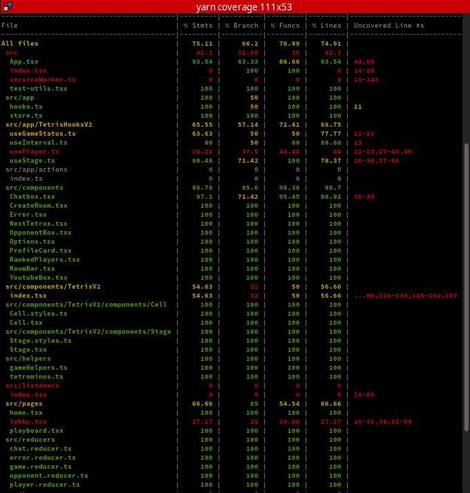
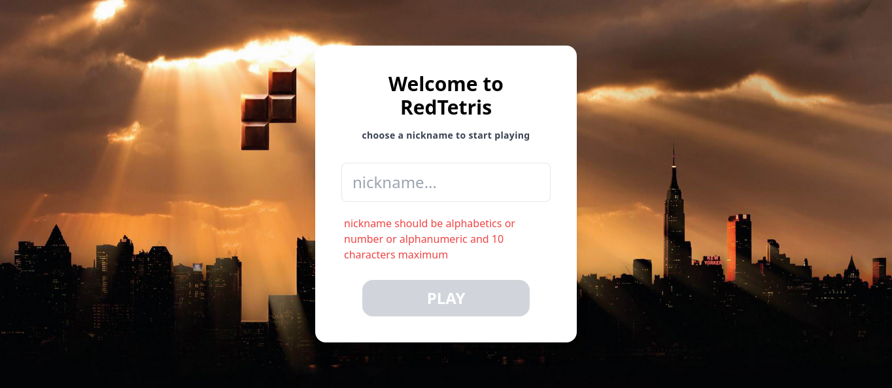
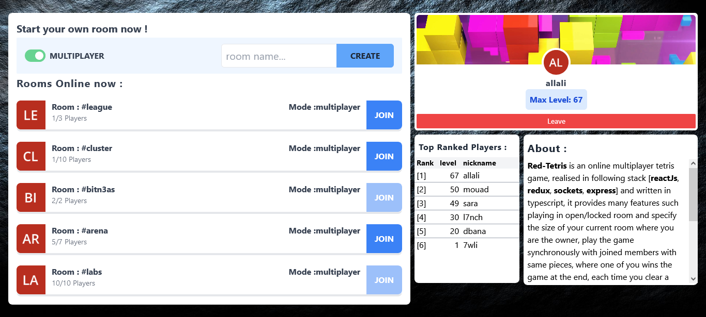
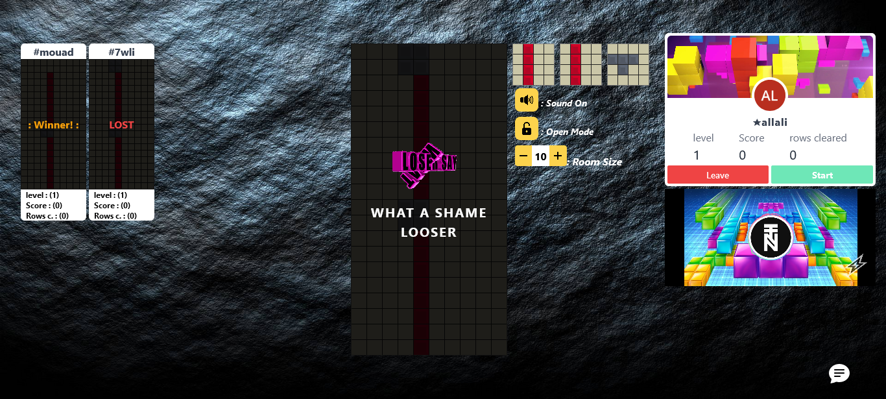
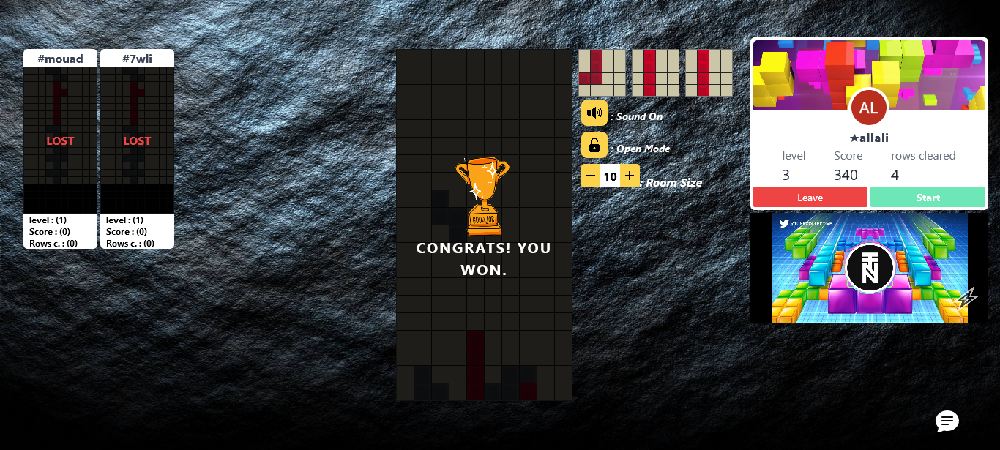
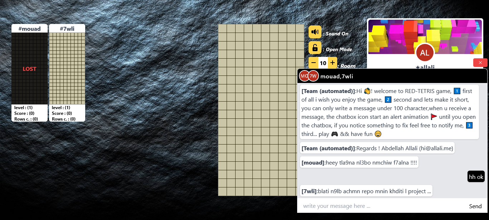

# RED-TETRIS
The objective of this project is to develop a networked multiplayer tetrisgame from a stack of software exclusively Full Stack Javascript

#### Frameworks/Libraries used :
- ReactJs
- ExpressJs
- Socket.IO
- Jest `for testing`
written in Typescript using OOP in core code of backend

#### Incomming ...
the game will be deployed soon to be dispponible online :
[https://allali.me/redtetris/](https://allali.me/redtetris/)
## Screen Shots of the game :
#### Tests written :

##### Coverage result (Stmts:75.11% | Branch: 66.2% | Funcs:76.99 % | Lines: 74.91%)

#### Home page :

#### Lobby page :

#### PlayBoard page , 1 :

#### PlayBoard page , 2 :

#### PlayBoard page , 3 :

.
.
.
.
.
.
.
.
.
#### Work Process
**start date** : `10-27-2021`
**finish date** : `11-20-2021` 
**total days** : `29` excluding a `6 days off`
**daily working hours** : `1-2 hours`

